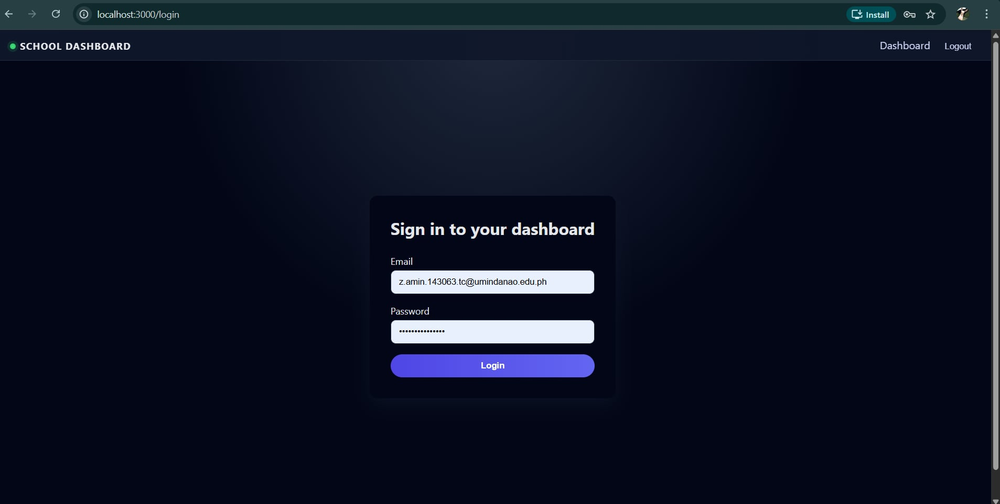
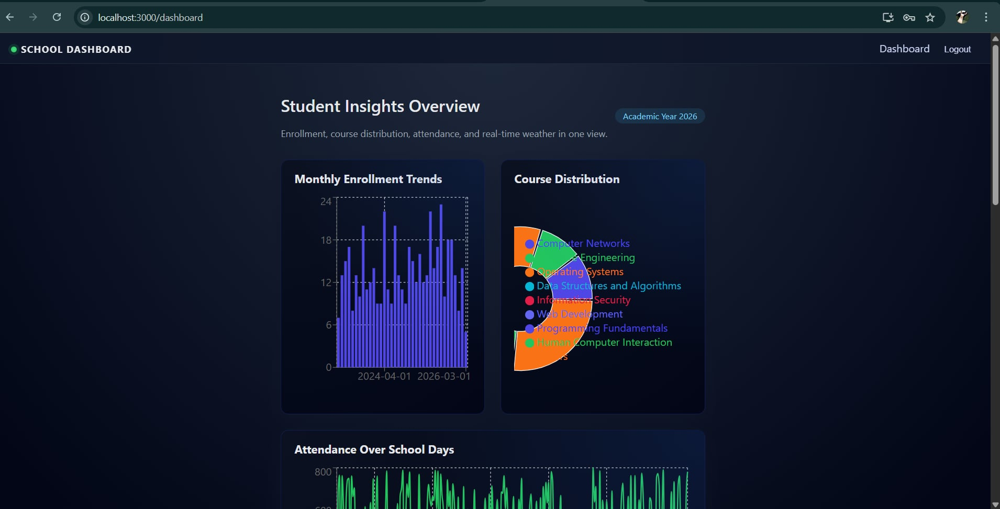

## Final Project – Backend (Laravel)

This repository contains the **backend** API for **STUDENT DASHBOARD/MANAGEMENT SYSTEM** built with Laravel.

---
### 1. Screenshots

### 1. Screenshots





---

### 2.More detail in [`docs/tech-stack.md`](docs/tech-stack.md).

---
### 3. Technologies Used

- Laravel **12.54.1**
- PHP **8.2.12**
- Composer **2.9.5**
- Database: **MySQL/PostgreSQL 8.0**
- Other: **list any major packages (e.g.Laravel Sanctum, Laravel Breeze, etc.)**

---
### 4. Video Demonstration

[Watch the video]()

---
### 5. Getting Started (Local Setup)

#### 5.1 Prerequisites

- PHP **8.2.12** or higher  
- Composer **2.9.5**  
- MySQL/PostgreSQL  
- Node.js & npm (if using Vite for assets)

#### 5.2 Installation

```bash
# from project root
cd laravel-backend

composer install

cp .env.example .env
php artisan key:generate

# configure your database in .env
php artisan migrate --seed

php artisan serve

